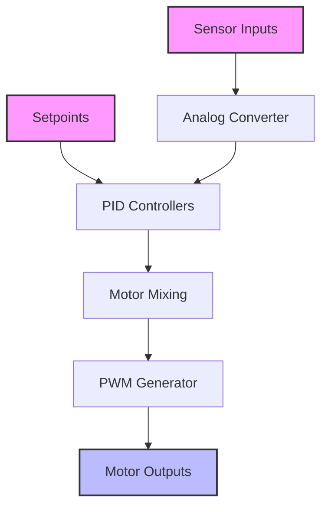
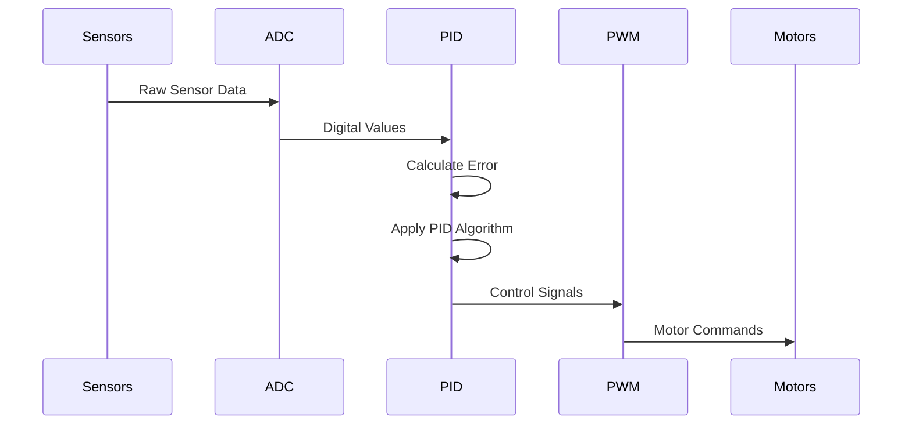
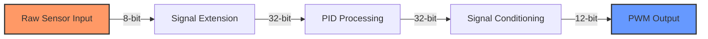

<div align="center">

# Flight Control Unit - Advanced Quadcopter Control System

🚁 A sophisticated VHDL-based flight control system for quadcopters implementing PID control across multiple axes.

## Tech Stack
[](#)
[](#)
[](#)

## Team PA22 
👑 **Andi Muhammad Alvin Farhansyah** - 2306161933  
**Ibnu Zaky Fauzi** - 2306161870  
**Samih Bassam** - 2306250623  
**Daffa Bagus Dhinanto** - 2306250756

---
</div>

## System Overview

This project implements a complete Flight Control Unit (FCU) for quadcopter stabilization and control using VHDL. The system provides precise control over roll, pitch, yaw, and height using PID controllers.



## Key Features

- 🎮 Multi-axis PID Control (Roll, Pitch, Yaw, Height)
- 📊 12-bit PWM Resolution
- 🔄 65Hz PWM Frequency
- 📈 Real-time Sensor Feedback
- 🔧 Configurable PID Parameters
- 🛠️ Advanced Motor Mixing Algorithm

## System Architecture

### Control Flow


### PID Controller Implementation

The system uses a sophisticated PID control algorithm with the following features:

- **Proportional Control (Kp = 20)**: Provides immediate response to error
- **Integral Control (Ki = 25)**: Eliminates steady-state error
- **Derivative Control (Kd = 1)**: Dampens oscillations

### Motor Mixing Algorithm

The quadcopter uses an X-configuration with the following mixing formulas:

```
Motor1 = Height + Pitch + Roll - Yaw
Motor2 = Height + Pitch - Roll + Yaw
Motor3 = Height - Pitch - Roll - Yaw
Motor4 = Height - Pitch + Roll + Yaw
```

## Technical Specifications

- System Clock: 100MHz
- PWM Frequency: 65Hz
- Resolution: 12-bit
- Data Width: 32-bit
- Internal Processing: 16-bit

## Signal Processing



## Components

1. **FlightControlUnit**: Main control entity
2. **MotorPIDControl**: PID controller implementation
3. **PWMGeneratorMotor**: PWM signal generation
4. **AnalogConverter**: Sensor data processing
5. **Integration**: Signal processing and filtering

## Implementation Details

### PID Controller Features

- Configurable gain parameters
- Anti-windup protection
- Signal averaging for noise reduction
- Error tracking and compensation

### PWM Generation

- High-resolution PWM output
- Complementary output pairs
- Dead-time insertion
- Frequency control

## Setup and Usage

1. **Hardware Requirements**
   - FPGA Development Board
   - Quadcopter Frame
   - Motors & ESCs
   - Sensors (Gyroscope, Accelerometer)

2. **Software Requirements**
   - Quartus Prime
   - ModelSim (for simulation)
   - VHDL Compiler

3. **Implementation Steps**
   - Synthesize the design using Quartus
   - Program the FPGA
   - Configure PID parameters
   - Calibrate sensors

## File Structure

```
└── FlightControlUnit_ProyekAkhirPSD/
    ├── RTL Synthesis from Quartus/
    │   ├── FlightControlUnit.vhd       # Main control unit
    │   ├── PID_Controller.vhd          # PID implementation
    │   ├── PWM_Generator.vhd           # PWM generation
    │   └── AnalogConverter.vhd         # ADC interface
    ├── VHDL_CODE/
    │   └── [Simulation files]
    └── PDF Makalah and Presentation/
        └── [Documentation]
```

## Performance Characteristics

- **Response Time**: < 15ms
- **Stability**: ±0.1° accuracy
- **Control Rate**: 65Hz update frequency
- **Resolution**: 12-bit control precision

## Safety Features

- System ready indication
- Motor failsafe controls
- Signal boundary checking
- Error state handling

## Contributing

This project is part of a PSD (Digital System Design) final project. Contributions and improvements are welcome through pull requests.

## License

This project is available for educational and research purposes. Please refer to the included documentation for more details.
